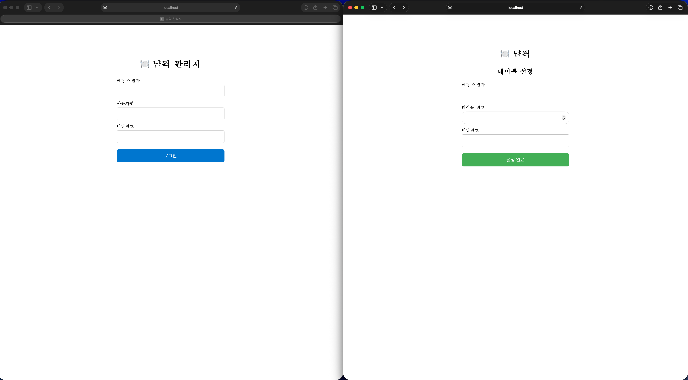
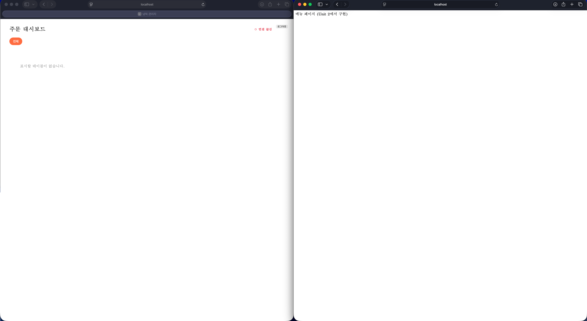

# 🍽️ 냠픽 (YumPick)

식당 테이블 주문 관리 시스템. 고객이 테이블에서 직접 메뉴를 보고 주문하고, 관리자가 주문을 실시간으로 모니터링할 수 있는 웹 애플리케이션.

## 스크린샷
로그인 전

로그인 후



## 프로젝트 구조

```
yumpick/
├── packages/
│   ├── server/          # Express + MongoDB 백엔드 (포트 3000)
│   ├── admin-app/       # 관리자 앱 - React + Vite (포트 5174)
│   ├── customer-app/    # 고객 앱 - React + Vite (포트 5173)
│   └── shared/          # 공유 타입 정의
└── package.json         # npm workspaces 루트
```

## 기술 스택

- **백엔드**: Express, TypeScript, Mongoose, JWT, bcrypt
- **프론트엔드**: React 18, Vite, Zustand, Axios, React Router
- **DB**: MongoDB
- **테스트**: Jest, Vitest, Testing Library

## 시작하기

### 사전 요구사항

- Node.js 18+
- MongoDB (로컬 또는 Atlas)

### 설치

```bash
npm install
```

### 서버 실행

```bash
cd packages/server
npm run dev
```

### 관리자 계정 생성 (시드)

```bash
cd packages/server
npm run seed                              # 기본: store1 / admin / admin1234
npm run seed -- mystore myadmin mypass    # 커스텀
```

### 프론트엔드 실행

```bash
# 관리자 앱
cd packages/admin-app
npm run dev

# 고객 앱
cd packages/customer-app
npm run dev
```

## 로그인 방법

### 관리자 로그인
관리자 앱(`http://localhost:5174`)에서 시드로 생성한 계정으로 로그인.

### 고객(테이블) 로그인
1. 관리자 앱에서 테이블 생성 (테이블 번호 + 비밀번호 설정)
2. 고객 앱(`http://localhost:5173`)에서 매장 식별자, 테이블 번호, 비밀번호 입력

## 주요 기능

- **인증**: JWT 기반 관리자/테이블 로그인, 자동 로그인, 로그인 시도 제한
- **메뉴 관리**: CRUD, 카테고리 분류, 정렬
- **주문**: 장바구니, 주문 생성, 실시간 상태 업데이트 (SSE)
- **테이블 관리**: 테이블 CRUD, 세션 관리, 과거 주문 내역 조회
- **실시간 모니터링**: SSE를 통한 주문 대시보드

## 테스트

```bash
# 전체
npm test

# 패키지별
cd packages/server && npm test
cd packages/admin-app && npm test
cd packages/customer-app && npm test
```
