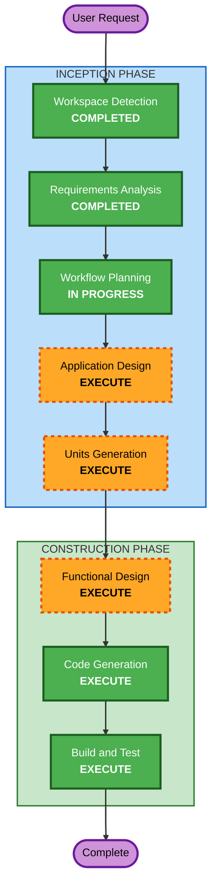

# Execution Plan

## Detailed Analysis Summary

### Change Impact Assessment
- **User-facing changes**: Yes - 고객용/관리자용 웹 앱 신규 개발
- **Structural changes**: Yes - 전체 시스템 아키텍처 신규 설계
- **Data model changes**: Yes - MongoDB 스키마 신규 설계 (Store, Table, Menu, Order, Session)
- **API changes**: Yes - REST API 전체 신규 설계
- **NFR impact**: Yes - SSE 실시간 통신, JWT 인증, 세션 관리

### Risk Assessment
- **Risk Level**: Medium
- **Rollback Complexity**: Easy (Greenfield - 롤백 불필요)
- **Testing Complexity**: Moderate (SSE, 인증, 세션 관리 테스트 필요)

## Workflow Visualization



### Text Alternative
```
Phase 1: INCEPTION
  - Workspace Detection      (COMPLETED)
  - Requirements Analysis     (COMPLETED)
  - Workflow Planning          (IN PROGRESS)
  - User Stories               (SKIP)
  - Application Design         (EXECUTE)
  - Units Generation           (EXECUTE)

Phase 2: CONSTRUCTION (per unit)
  - Functional Design          (EXECUTE)
  - NFR Requirements           (SKIP)
  - NFR Design                 (SKIP)
  - Infrastructure Design      (SKIP)
  - Code Generation            (EXECUTE)
  - Build and Test             (EXECUTE)

Phase 3: OPERATIONS
  - Operations                 (PLACEHOLDER)
```

## Phases to Execute

### INCEPTION PHASE
- [x] Workspace Detection (COMPLETED)
- [x] Requirements Analysis (COMPLETED)
- [ ] User Stories - SKIP
  - **Rationale**: 단일 매장 MVP, 사용자 유형이 명확 (고객/관리자), 요구사항이 충분히 상세
- [x] Workflow Planning (IN PROGRESS)
- [ ] Application Design - EXECUTE
  - **Rationale**: 신규 프로젝트로 컴포넌트 구조, API 설계, 데이터 모델 정의 필요
- [ ] Units Generation - EXECUTE
  - **Rationale**: 5명 병렬 작업을 위해 5개 유닛으로 분해 필요

### CONSTRUCTION PHASE (per unit)
- [ ] Functional Design - EXECUTE
  - **Rationale**: MongoDB 스키마, API 엔드포인트, 비즈니스 로직 상세 설계 필요
- [ ] NFR Requirements - SKIP
  - **Rationale**: Security/PBT 확장 비활성화, MVP 수준의 NFR은 요구사항에 이미 포함
- [ ] NFR Design - SKIP
  - **Rationale**: NFR Requirements 스킵으로 인해 스킵
- [ ] Infrastructure Design - SKIP
  - **Rationale**: MVP 단계에서 인프라 설계는 Build and Test에서 간략히 다룸
- [ ] Code Generation - EXECUTE (ALWAYS)
  - **Rationale**: 전체 애플리케이션 코드 생성
- [ ] Build and Test - EXECUTE (ALWAYS)
  - **Rationale**: 빌드 및 테스트 지침 생성

### OPERATIONS PHASE
- [ ] Operations - PLACEHOLDER

## Success Criteria
- **Primary Goal**: 냠픽(Yumpick) 테이블오더 MVP 서비스 완성
- **Key Deliverables**:
  - Node.js/Express 백엔드 API 서버
  - React 고객용 주문 앱
  - React 관리자용 관리 앱
  - MongoDB 데이터 모델
  - 빌드 및 테스트 지침
- **Quality Gates**:
  - 모든 API 엔드포인트 동작 확인
  - 고객 주문 플로우 정상 동작
  - 관리자 SSE 실시간 모니터링 동작
  - JWT 인증/세션 관리 동작
